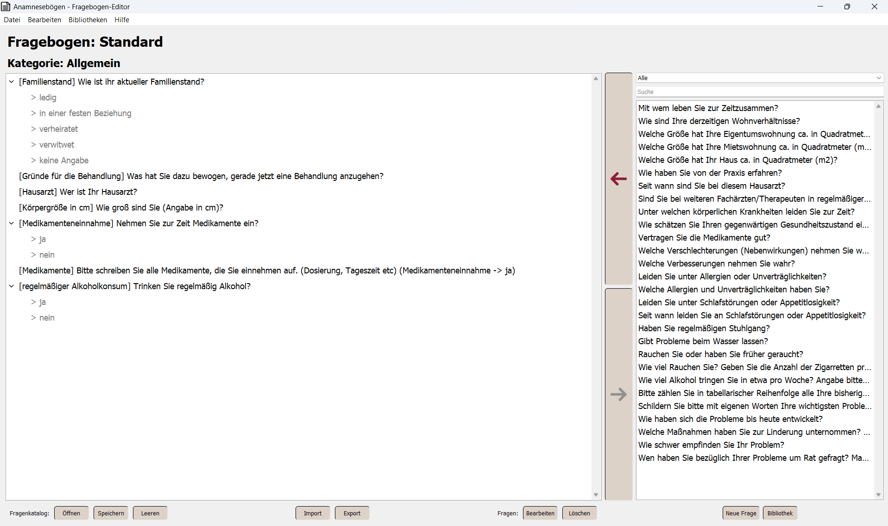
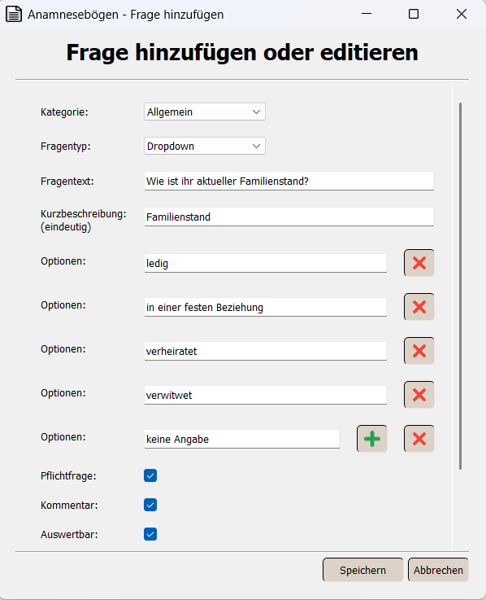
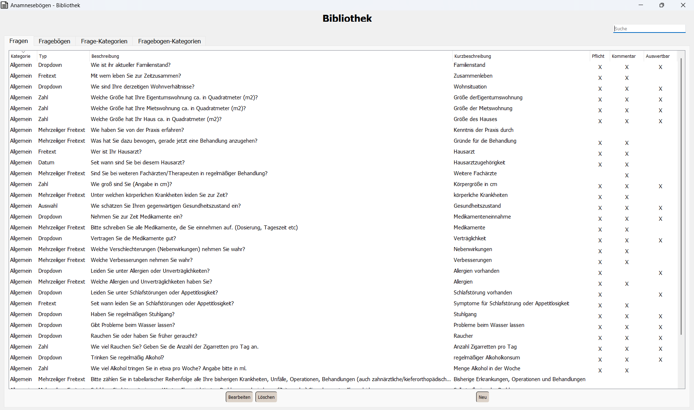

# <ins>Medical History Forms</ins>

A desktop application for creating and managing medical history questionnaires tailored for clinical environments and physicians.<br>
This project provides an intuitive interface to create structured, categorized anamnesis forms using a local database. It is designed for local use in clinics or private practices and allows medical professionals to build customized questionnaires for patient intake, assessments, or treatment tracking.

<br>

### 🎯 <ins>Purpose</ins>
The main goal of this application is to physicians and clinics to design, manage and export patient anamnesis forms easily. Through a drag & drop interface and a categorized structure, users can intuitively build and reuse complex forms – including logic for mandatory questions and dependencies.

<br>

### 👥 <ins>Target Users</ins>
- Physicians (private practice or clinical settings)
- Internal use in hospitals or medical centers

<br>

### 🧩 <ins>Key Features</ins>
- **Categorized Questions & Forms**
- **Drag & Drop Editing**
- **Support for Multiple Question Types** (Dropdowns, Free Text, Numeric Input, etc.)
- **Automatic Question Dependencies**
  - e.g. "Are you pregnant?" → automatically adds "Since when?" if answered "Yes"
- **Import/Export of JSON Forms**
- **Edit Existing Questions and Forms**
- **Required Questions Support**
- **Comment and Evaluation Flags for Analysis**
- **SQLite Support**

<br>

#### 🖼️️ <ins>Preview</ins>

#### 🧾 Main Page

**Figure 1:** Tree-structured editor showing questions grouped by categories. Questions with dependencies are automatically linked and added when conditions are met.<br><br>

#### ➕ Add or Edit a Question

<br>**Figure 2:** Dialog window for adding or editing a question, including dropdown options, mandatory settings, and dependency logic.<br><br>

#### 📚 Question Library

**Figure 3:** Centralized view of all saved questions in the system, including their type, description, and properties like "Required", "Comment", and "Evaluable".

<br>

### 🛠️ <ins>Setup & Installation</ins>

```bash
git clone https://github.com/martin-kunz/Medical-History-Forms.git
cd Medical-History-Forms
pip install -r requirements.txt
```

#### ▶️ Launch the App

```bash
python main.py
```

<br>

### 📁 <ins>Project Structure</ins>

```
martin-kunz-medical-history-forms/
├── main.py                     # Entry point
├── requirements.txt            # Required packages
├── config/                     # Configuration files
├── data/                       # Local database
├── designerFiles/              # UI definitions (.ui + Python wrappers)
├── GUI/                        # GUI logic
├── docs/                       # Generated documentation
├── database/                   # DB abstraction (SQLite & MySQL)
└── Example-JSONs/              # Sample form files
```